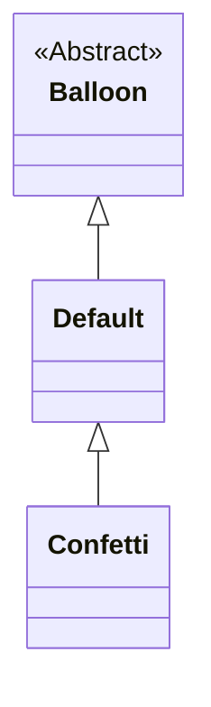
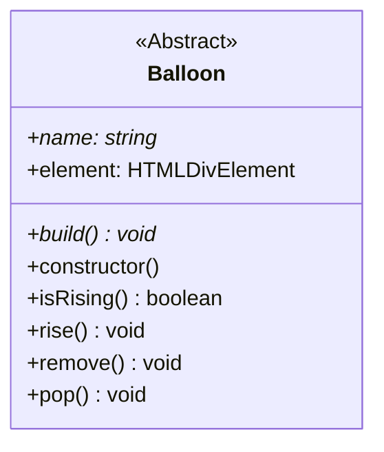

<h1 align="center">Pop-a-loon documentation</h1>

## Table of Contents

<!-- markdownlint-disable link-fragments -->

- [Table of Contents](#table-of-contents)
- [Getting Started](#getting-started)
  - [Requirements](#requirements)
  - [Installation](#installation)
  - [Development](#development)
    - [dev:chrome](#devchrome)
    - [dev:chrome:noremote](#devchromenoremote)
    - [dev:chrome:remote](#devchromeremote)
    - [dev:firefox](#devfirefox)
    - [dev:firefox:noremote](#devfirefoxnoremote)
    - [dev:firefox:remote](#devfirefoxremote)
  - [Load the extension to chrome](#load-the-extension-to-chrome)
  - [Load the extension to firefox](#load-the-extension-to-firefox)
  - [Debugging in Visual Studio Code](#debugging-in-visual-studio-code)
  - [Deployment](#deployment)
    - [build:chrome](#buildchrome)
    - [build:chrome:zip](#buildchromezip)
    - [build:firefox](#buildfirefox)
    - [build:firefox:zip](#buildfirefoxzip)
    - [build:all:zip](#buildallzip)
    - [zip:source](#zipsource)
- [Architecture](#architecture)
- [Balloon spawn chances](#balloon-spawn-chances)
- [Inheritance Tree](#inheritance-tree)
- [Abstract balloon class](#abstract-balloon-class)
- [Balloons](#balloons)
  - [Default balloon](#default-balloon)
  - [Confetti balloon](#confetti-balloon)

<!-- markdownlint-enable link-fragments -->

## Getting Started

### Requirements

<!-- These are used in development at the time of writing, other versions aren't tested but should work -->

- [Node.js](https://nodejs.org/) (`>= v21.1.0`)
- [npm](https://www.npmjs.com/) (`>= v10.3.0`)

### Installation

Clone the repository:

```bash
git clone https://github.com/SimonStnn/pop-a-loon
```

Install the dependencies:

```bash
npm install
```

### Development

Building for development can be done with the `dev:{browser}` script. Replace `{browser}` with the browser you want to build for. The available options are `chrome` and `firefox`.

> [!TIP]
> See the [Load the extension to chrome](#load-the-extension-to-chrome) and [Load the extension to firefox](#load-the-extension-to-firefox) sections for instructions on how to load the extension in the browser.

#### dev:chrome

<!-- markdownlint-disable link-fragments -->

> [!IMPORTANT]
> This will call the [dev:chrome:noremote](#devchromenoremote) script.

<!-- markdownlint-enable link-fragments -->

To build for Chrome:

```bash
npm run dev:chrome
```

This will build the extension in development mode for chrome. You can also include the `--watch` flag to automatically rebuild the extension when files change.

```bash
npm run dev:chrome -- --watch
```

#### dev:chrome:noremote

To build for Chrome without a remote server[^1]:

```bash
npm run dev:chrome:noremote
```

This will build the extension in development mode for chrome without a remote server. You can also include the `--watch` flag to automatically rebuild the extension when files change.

```bash
npm run dev:chrome:noremote -- --watch
```

#### dev:chrome:remote

> [!IMPORTANT]
> This will connect to a [pop-a-loon-backend](https://github.com/SimonStnn/pop-a-loon-backend) server which is expected to be running on `http://localhost:3000`.

To build for Chrome with a remote server:

```bash
npm run dev:chrome:remote
```

#### dev:firefox

<!-- markdownlint-disable link-fragments -->

> [!IMPORTANT]
> This will call the [dev:firefox:noremote](#devfirefoxnoremote) script.

<!-- markdownlint-enable link-fragments -->

To build for Firefox:

```bash
npm run dev:firefox
```

This will build the extension in development mode for firefox. You can also include the `--watch` flag to automatically rebuild the extension when files change.

```bash
npm run dev:firefox -- --watch
```

#### dev:firefox:noremote

To build for Firefox without a remote server[^1]:

```bash
npm run dev:firefox:noremote
```

This will build the extension in development mode for firefox without a remote server. You can also include the `--watch` flag to automatically rebuild the extension when files change.

```bash
npm run dev:firefox:noremote -- --watch
```

#### dev:firefox:remote

> [!IMPORTANT]
> This will connect to a [pop-a-loon-backend](https://github.com/SimonStnn/pop-a-loon-backend) server which is expected to be running on `http://localhost:3000`.

To build for Firefox with a remote server:

```bash
npm run dev:firefox:remote
```

This will build the extension in development mode for firefox with a remote server. You can also include the `--watch` flag to automatically rebuild the extension when files change.

```bash
npm run dev:firefox:remote -- --watch
```

[^1]: The requests to the remote will be 'mocked' so the extension can be developed without the need for a running server.

### Load the extension to chrome

The extension can be loaded in the browser by following the steps below:

1. Open the Extension Management page by navigating to [`chrome://extensions`](chrome://extensions).

   > Don't forget to enable Developer mode in the top right corner.

2. Click the `Load unpacked` button and select the `dist/` directory.
3. The extension should now be loaded and you can see the icon in the browser toolbar.
4. Pin the extension to the toolbar for easy access.

### Load the extension to firefox

The extension can be loaded in the browser by following the steps below:

1. Open the Add-ons page by navigating to [`about:addons`](about:addons).
2. Click the `Extensions` tab on the left.
3. Click the `Manage your extensions` button.
4. Click the `Debug Add-ons` button.
5. Click the `Load Temporary Add-on` button and select the `manifest.json` file in the `dist/` directory.
6. The extension should now be loaded and you can see the icon in the browser toolbar.
7. Pin the extension to the toolbar for easy access.

### Debugging in Visual Studio Code

1. Open the project in Visual Studio Code.
2. Go to the Run view (Ctrl+Shift+D).
3. Select `Launch Chrome` or `Launch Firefox` from the dropdown at the top of the Run view.
4. Press the Start Debugging button (F5).

This will start the development server (if it's not already running) and open a new browser instance with debugging enabled.

### Deployment

To build the extension for production, use the `build:{browser}` script. Replace `{browser}` with the browser you want to build for. The available options are `chrome` and `firefox`. You can also include `:zip` to create a zip file of the extension.

#### build:chrome

To build for Chrome:

```bash
npm run build:chrome
```

#### build:chrome:zip

This will build the extension in production mode for chrome. You can also include the `:zip` flag to create a zip file of the extension.

```bash
npm run build:chrome:zip
```

The zip file will be created in the `build/` directory.

#### build:firefox

To build for Firefox:

```bash
npm run build:firefox
```

#### build:firefox:zip

This will build the extension in production mode for firefox. You can also include the `:zip` flag to create a zip file of the extension.

```bash
npm run build:firefox:zip
```

#### build:all:zip

<!-- markdownlint-disable link-fragments -->

This will build the extension in production for all browsers and include a [zip file of the source code](#zipsource).

<!-- markdownlint-enable link-fragments -->

```bash
npm run build:all:zip
```

#### zip:source

This will create a zip file of the source code. The zip file will be created in the `build/` directory with the name `source-v{version}.zip`.

```bash
npm run zip:source
```

The zip file will be created in the `build/` directory.

## Architecture

> [!NOTE]
> Read the [Architecture](./Architecture.md) document for a more detailed explanation of the architecture.

## Balloon spawn chances


## Inheritance Tree



## Abstract balloon class

The abstract balloon class is the base class for all balloons.



The class serves as a base class for each balloon in pop-a-loon, providing essential functionality that must operate from this class.

> [!IMPORTANT]
> The class has the following abstract properties and methods:
>
> - `name`: The name of the balloon. Should be the same as the name of the class, but in lowercase.
> - `build()`: Is called when the balloon should be built. In this method the class should for example add the styling and balloon image to the balloon element.

These properties and methods **must** be implemented in the child classes.

> [!IMPORTANT] > `element` is the html element that will be added to the DOM after the balloon is built.

## Balloons

### Default balloon

See [Default balloon documentation](./balloons/default.md) for more information.

### Confetti balloon

See [Confetti balloon documentation](./balloons/confetti.md) for more information.
