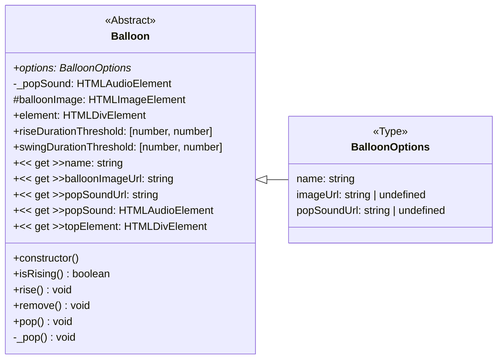
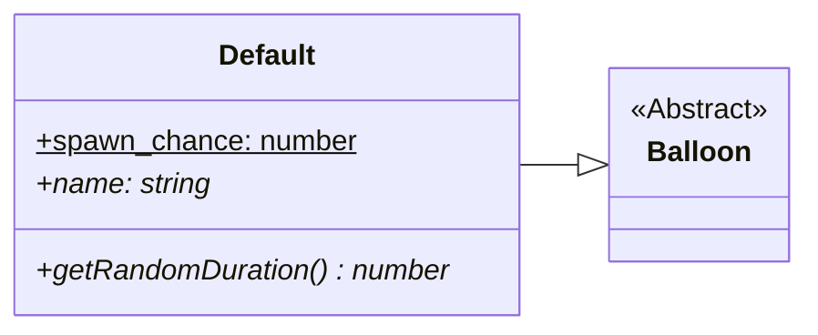

<h1 align="center">Pop-a-loon documentation</h1>

## Table of Contents

<!-- markdownlint-disable link-fragments -->

- [Table of Contents](#table-of-contents)
- [Getting Started](#getting-started)
  - [Requirements](#requirements)
  - [Installation](#installation)
  - [Development](#development)
    - [dev:chrome](#devchrome)
    - [dev:firefox](#devfirefox)
  - [Debugging in Visual Studio Code](#debugging-in-visual-studio-code)
  - [Deployment](#deployment)
    - [build:chrome](#buildchrome)
    - [build:chrome:zip](#buildchromezip)
    - [build:firefox](#buildfirefox)
    - [build:firefox:zip](#buildfirefoxzip)
- [Architecture](#architecture)
- [Balloon spawn chances](#balloon-spawn-chances)
- [Balloons](#balloons)
  - [Abstract balloon class](#abstract-balloon-class)
  - [Default balloon](#default-balloon)

<!-- markdownlint-enable link-fragments -->

## Getting Started

### Requirements

<!-- These are used in development at the time of writing, other versions aren't tested but should work -->

- [Node.js](https://nodejs.org/) (`>= v21.1.0`)
- [npm](https://www.npmjs.com/) (`>= v10.3.0`)

### Installation

Clone the repository:

```bash
git clone https://github.com/SimonStnn/pop-a-loon
```

Install the dependencies:

```bash
npm install
```

### Development

Building for development can be done with the `dev:{browser}` script. Replace `{browser}` with the browser you want to build for. The available options are `chrome` and `firefox`.

#### dev:chrome

To build for Chrome:

```bash
npm run dev:chrome
```

This will build the extension in development mode for chrome. You can also include the `--watch` flag to automatically rebuild the extension when files change.

```bash
npm run dev:chrome -- --watch
```

The extension can be loaded in the browser by following the steps below:

1. Open the Extension Management page by navigating to [`chrome://extensions`](chrome://extensions).

   > Don't forget to enable Developer mode in the top right corner.

2. Click the `Load unpacked` button and select the `dist/` directory.
3. The extension should now be loaded and you can see the icon in the browser toolbar.
4. Pin the extension to the toolbar for easy access.

#### dev:firefox

To build for Firefox:

```bash
npm run dev:firefox
```

This will build the extension in development mode for firefox. You can also include the `--watch` flag to automatically rebuild the extension when files change.

```bash
npm run dev:firefox -- --watch
```

The extension can be loaded in the browser by following the steps below:

1. Open the Add-ons page by navigating to [`about:addons`](about:addons).
2. Click the `Extensions` tab on the left.
3. Click the `Manage your extensions` button.
4. Click the `Debug Add-ons` button.
5. Click the `Load Temporary Add-on` button and select the `manifest.json` file in the `dist/` directory.
6. The extension should now be loaded and you can see the icon in the browser toolbar.
7. Pin the extension to the toolbar for easy access.

### Debugging in Visual Studio Code

1. Open the project in Visual Studio Code.
2. Go to the Run view (Ctrl+Shift+D).
3. Select `Launch Chrome` or `Launch Firefox` from the dropdown at the top of the Run view.
4. Press the Start Debugging button (F5).

This will start the development server (if it's not already running) and open a new browser instance with debugging enabled.

### Deployment

To build the extension for production, use the `build:{browser}` script. Replace `{browser}` with the browser you want to build for. The available options are `chrome` and `firefox`. You can also include `:zip` to create a zip file of the extension.

#### build:chrome

To build for Chrome:

```bash
npm run build:chrome
```

#### build:chrome:zip

This will build the extension in production mode for chrome. You can also include the `:zip` flag to create a zip file of the extension.

```bash
npm run build:chrome:zip
```

The zip file will be created in the `build/` directory.

#### build:firefox

To build for Firefox:

```bash
npm run build:firefox
```

#### build:firefox:zip

This will build the extension in production mode for firefox. You can also include the `:zip` flag to create a zip file of the extension.

```bash
npm run build:firefox:zip
```

The zip file will be created in the `build/` directory.

## Architecture

## Balloon spawn chances


## Balloons

### Abstract balloon class

The abstract balloon class is the base class for all balloons.



### Default balloon

The default balloon is a simple balloon that rises and pops when clicked.


