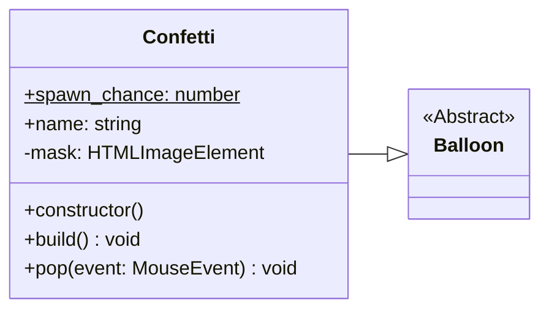

# Confetti

The confetti balloon is a balloon that spawns confetti when popped.

```mermaid
classDiagram
direction LR
class Balloon { <<Abstract>> }
click Balloon href "#abstract-balloon-class" "Abstract balloon class"

class Confetti {
  +spawn_chance: number$
  +name: string
  -mask: HTMLImageElement
  +constructor()
  +build() void
  +pop(event: MouseEvent) void
}
Confetti --|> Balloon
```
