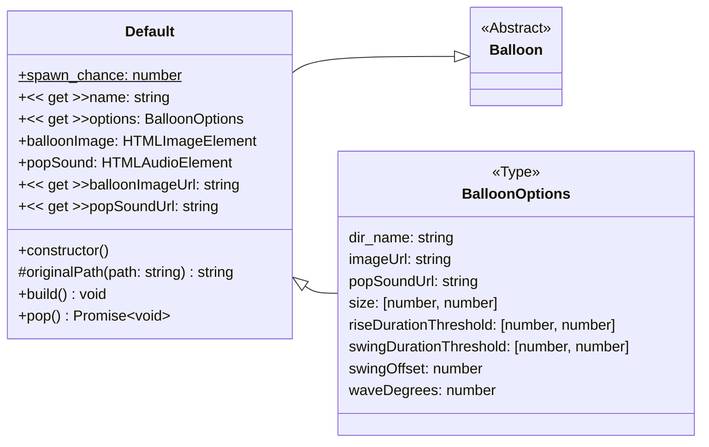

# Default

The default balloon is a simple balloon that rises and pops when clicked.

```mermaid
classDiagram
direction LR
class Balloon { <<Abstract>> }
click Balloon href "#abstract-balloon-class" "Abstract balloon class"

class Default {
  +spawn_chance: number$
  +<< get >>name: string
  +<< get >>options: BalloonOptions
  +balloonImage: HTMLImageElement
  +popSound: HTMLAudioElement
  +<< get >>balloonImageUrl: string
  +<< get >>popSoundUrl: string
  +constructor()
  #originalPath(path: string) string
  +build() void
  +pop() Promise~void~
}
Default --|> Balloon

class BalloonOptions {
  <<Type>>
  dir_name: string
  imageUrl: string
  popSoundUrl: string
  size: [number, number]
  riseDurationThreshold: [number, number]
  swingDurationThreshold: [number, number]
  swingOffset: number
  waveDegrees: number
}

Default <|-- BalloonOptions
```
