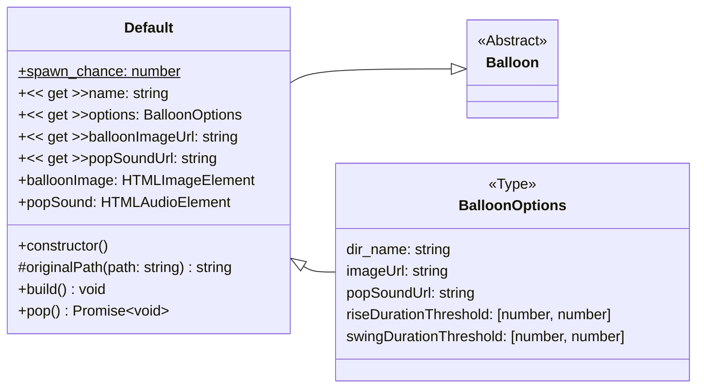

# Default

The default balloon is a simple balloon that rises and pops when clicked.



## Inheriting

To create a new balloon, extend the `Default` class and implement the abstract methods.

```ts
class Example extends Default {
  public static readonly spawn_chance: number = 0.25;
  // @ts-ignore
  public get name(): 'example' {
    return 'example';
  }

  public get options(): BalloonOptions {
    return {
      ...super.options,
      // Override options here
      // e.g. the image url
      imageUrl: 'example.svg',
    };
  }
}
```

In this example the `Example` class extends the `Default` class and overrides the `spawn_chance`, `name` and `options` properties. The options property overrides the image url to `example.svg`. Pop-a-loon will look for this `example.svg` file in the `resources/balloons/example` directory.
