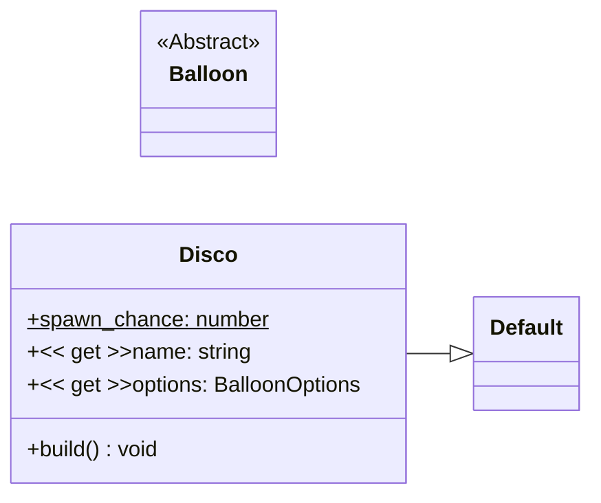

# Disco

The disco balloon is a colorful, spinning balloon with flashing gradient colors and a glowing effect, perfect for adding a party atmosphere to your browsing experience.

Has a custom image resource in [`/resources/balloons/disco/balloon.svg`](/resources/balloons/disco/balloon.svg).

