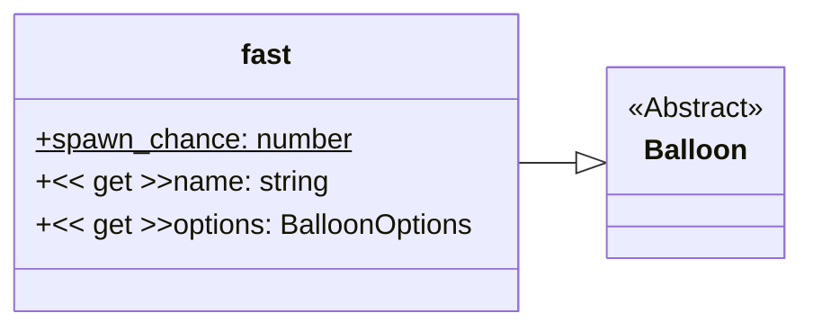

# Fast

Just like the [default balloon](./default.md), but way faster.

```mermaid
classDiagram
direction LR
class Balloon { <<Abstract>> }
click Balloon href "#abstract-balloon-class" "Abstract balloon class"

class fast {
  +spawn_chance: number$
  +<< get >>name: string
  +<< get >>options: BalloonOptions
}
fast --|> Balloon
```

Has a custom image resource in [`/resources/balloons/fast/fast.svg`](/resources/balloons/fast/fast.svg).

