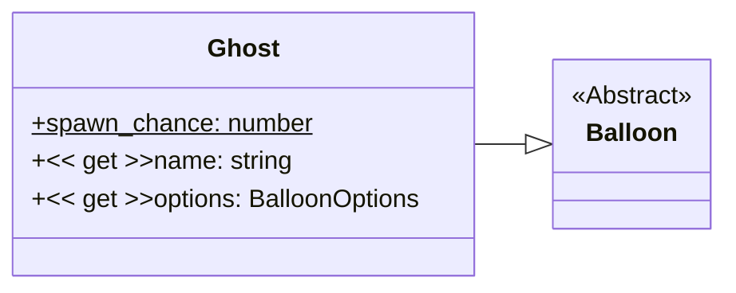

# Ghost

This is a balloon spawned from the spiritworld. Just like a ghost this balloon sways from side to side en turns slightly invisible.

Has a custom image resource in [`/resources/balloons/ghost/balloon.svg`](/resources/balloons/ghost/balloon.svg).

