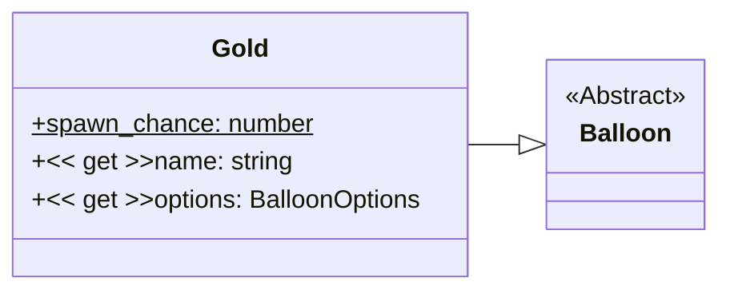

# Gold

Just like the [default balloon](./default.md), but :sparkles: golden :sparkles:.

Has a custom image resource in [`/resources/balloons/gold/balloon.svg`](/resources/balloons/gold/balloon.svg).

